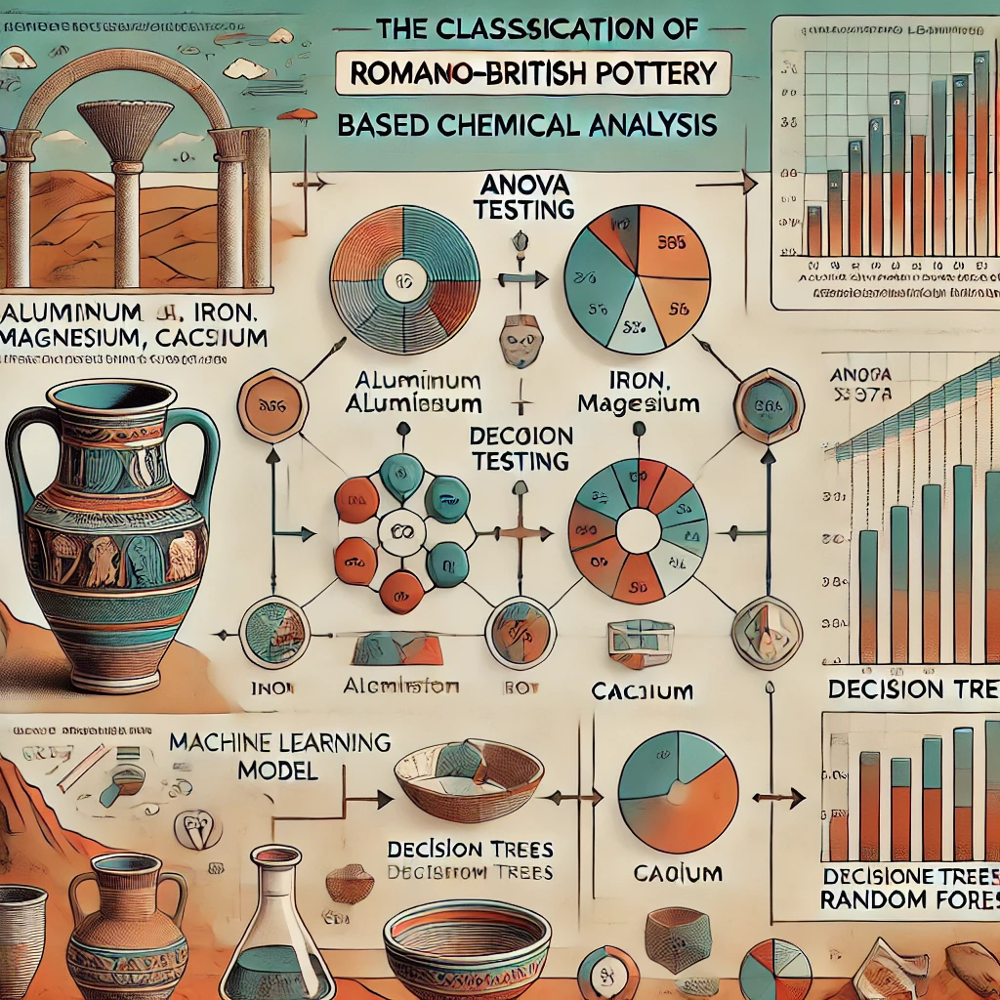

  
# Classification Models: Romano-British Pottery

  

# Project Summary

The project focuses on the application of classification models to samples of ancient Romano-British pottery, collected from four sites in the United Kingdom (L, C, I, A). A detailed chemical analysis was conducted on the samples to measure the percentage of five metal oxides present in each: Aluminum (Al), Iron (Fe), Magnesium (Mg), Calcium (Ca), and Sodium (Na).

# Objective

To predict the origin site of the samples based on their chemical composition using different classification models.

# Data Description

The set of predictor variables corresponds to the following chemicals found in the Romano-British pottery samples:

- **Aluminum (Al)**: Percentage of aluminum in the sample.
- **Iron (Fe)**: Percentage of iron in the sample.
- **Magnesium (Mg)**: Percentage of magnesium in the sample.
- **Calcium (Ca)**: Percentage of calcium in the sample.
- **Sodium (Na)**: Percentage of sodium in the sample.

The target variable is **Site**, which represents the origin of the sample. This is a categorical variable, with the possible values: *C, I, A, and L*.

# Technologies Used

* Language  : Python
* Libraries : `Matplotlib`, `Numpy`, `Pandas`, `SciPy`, `Scikit-learn`, `Sklearn`
* Environment: Visual Studio Code

# Procedure

* Exploratory data analysis
* Data extraction and cleaning processes
* ANOVA pertinence analysis
* Implementation of Machine Learning models: Decision Trees and Random Forest.

# Results

Two classification models were implemented, each yielding notable results:

* **ANOVA Analysis:** An ANOVA test was conducted to evaluate independence, normality of observations, and homoscedasticity across groups. However, the normality conditions were not met for the entire dataset, leading to the conclusion that an ANOVA test was not suitable in this context.

* **Decision Tree Classifier:** This initial model achieved an accuracy *(percentage of correct predictions over total predictions made)* of **75%**. An error analysis was conducted using a confusion matrix, allowing identification of incorrect predictions and further model improvement.

* **Random Forest Classifier:** Using hyperparameter tuning with grid search, this model achieved an accuracy of **87.5%**, significantly outperforming the previous model.

# Conclusions

Through the application of machine learning techniques, this project demonstrates the utility of classification methods in the chemical analysis of pottery. Furthermore, in this context, the ability to predict the origin site of samples based on their chemical composition not only contributes to the historical understanding of Romano-British pottery but also showcases the potential of data science in archaeological analysis. These results highlight the importance of selecting the appropriate model and optimizing its parameters to achieve more accurate classification.

**_The coments in the code are originally in spanish but I´ll upload an english version soon._**
